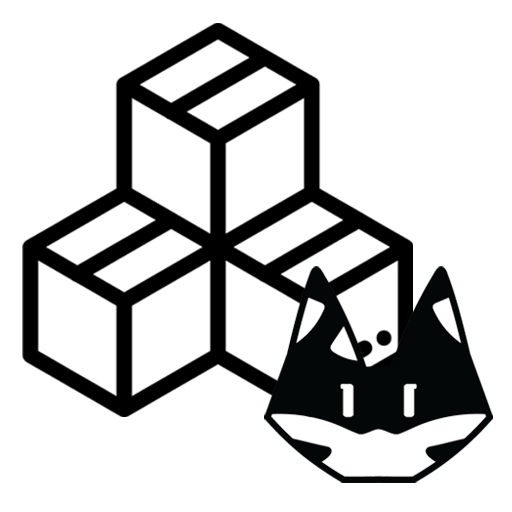
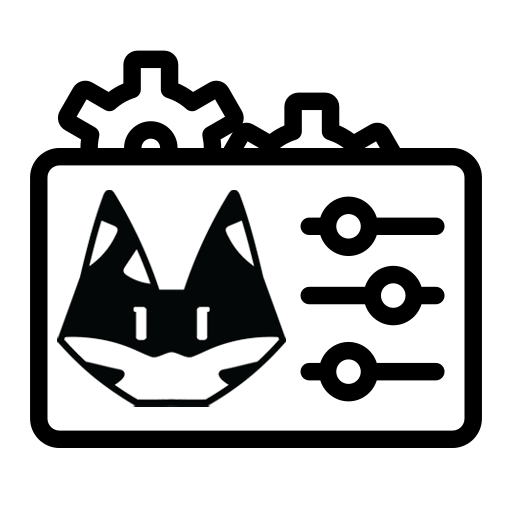

# PSG API

<div style="display: flex; justify-content: center; align-items: center;">
  
  <h1 style="font-size: 3em; margin-left: 10px;">+</h1>
  
  <h1 style="font-size: 3em; margin-left: 10px;">+ API</h1>
</div>

This is a API for Packing Station Gateway & Packing Station Gateway Admin. It uses [NestJS](https://nestjs.com) framework. with [Prisma](https://www.prisma.io) as ORM.

This project should be use with
- [PSG](https://github.com/beam7894123/gateway-packing-station)
- [PSG Admin panel (Demo)](https://github.com/beam7894123/gateway-packing-station/tree/demo).


## Postman Api Collection
You can find the postman collection [here](/Packing%20Station.postman_collection.json)

## Setup

```bash
$ npm install
```

## Compile and run the project

1. Set up the database connection in the `.env` file.
2. Run the following command to generate the Prisma client:
    ```bash
    $ npx prisma init
    ```

3. Start the development server:
    ```bash
    # development
    $ npm run start

    # watch mode
    $ npm run start:dev

    # production mode
    $ npm run start:prod
    ```


## Run tests

```bash
# unit tests
$ npm run test

# e2e tests
$ npm run test:e2e

# test coverage
$ npm run test:cov
```

## Deployment

When you're ready to deploy your NestJS application to production, there are some key steps you can take to ensure it runs as efficiently as possible. Check out the [deployment documentation](https://docs.nestjs.com/deployment) for more information.

If you are looking for a cloud-based platform to deploy your NestJS application, check out [Mau](https://mau.nestjs.com), our official platform for deploying NestJS applications on AWS. Mau makes deployment straightforward and fast, requiring just a few simple steps:

```bash
$ npm install -g mau
$ mau deploy
```

With Mau, you can deploy your application in just a few clicks, allowing you to focus on building features rather than managing infrastructure.

## License
Copyright 2025 [BezaTheCat](https://bezathecat.com) & Nest is [MIT licensed](/LICENSE).
