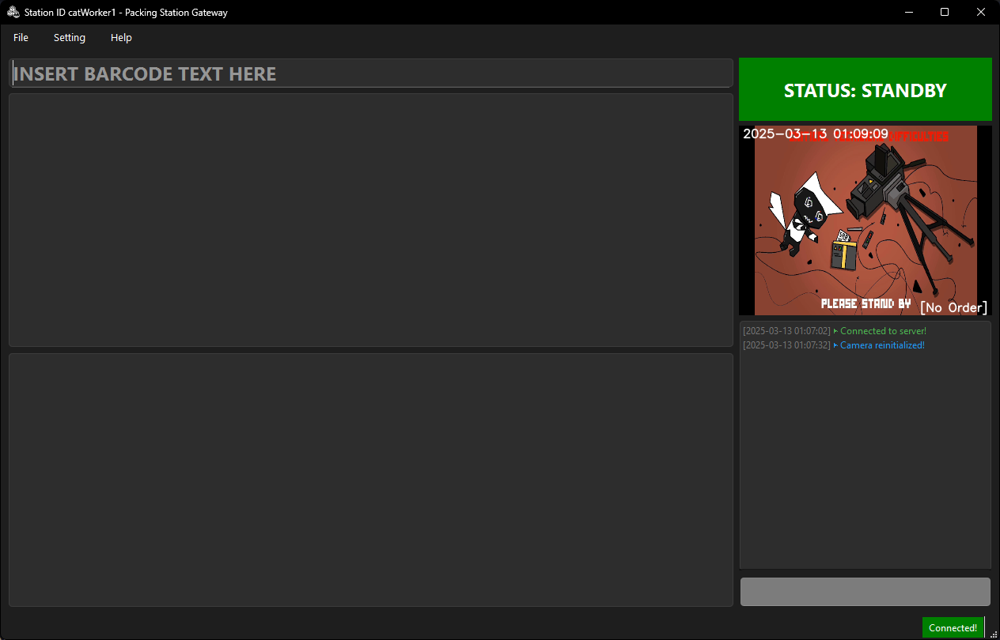

# Packing Station Gateway



## Overview

Packing Station Gateway is my senior project that designed to streamline and optimize the packing process ~~for e-commerce businesses~~. <!-- :P --> The application provides an efficient workflow for packing orders, allowing users to quickly and accurately pack items for shipment. The application also integrates with existing systems, allowing users to import order data and synchronize packing information with other platforms this helps businesses improve efficiency, reduce errors, and deliver a better customer experience.

## Features

- Efficient packing workflow
- User-friendly interface
- Integration with existing systems (Check out my demo for more information)

## Run from source!

To get started with the project, follow these steps:
1. Download and install [Python 3.10 or up](https://www.python.org/downloads/)
    - Optional: download and install [Make for Windows](http://gnuwin32.sourceforge.net/packages/make.htm) for easier commands

2. Clone the repository

3. Navigate to the project directory:

4. Install the necessary dependencies:
    ```
    make install
    ```
    or 
    ```
    pip install -r requirements.txt
    ```
5. Run the application:
    ```sh
    make run
    ```
    or
    ```
    python .\src\main.py
    ```
6. Enjoy! :3

## Contributing
idk just make a pull request or something

## License

This project is licensed under the GNU General Public License v3.0 - see the [LICENSE](LICENSE) file for details. :3